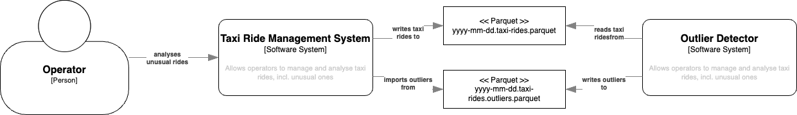
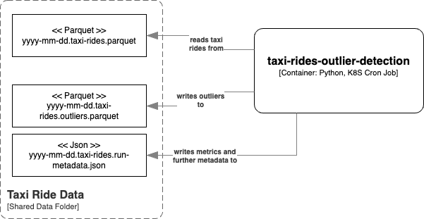
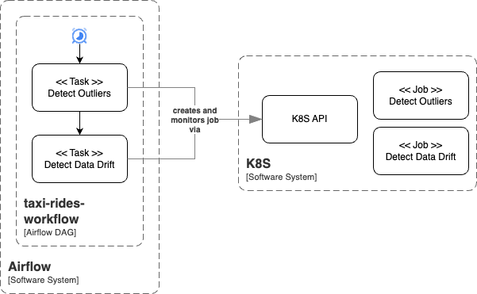
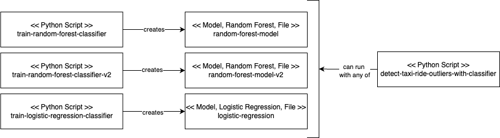
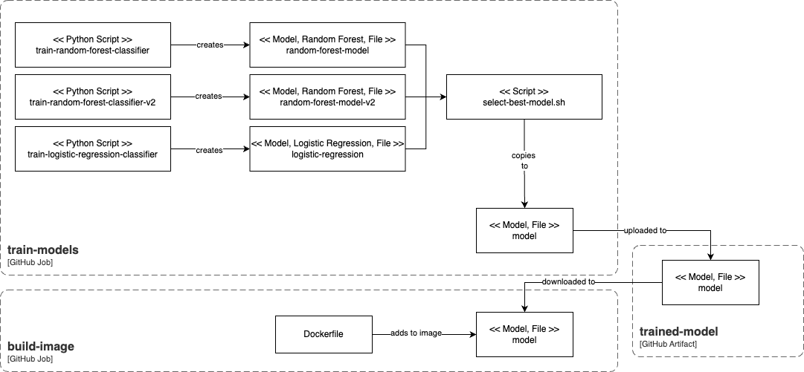
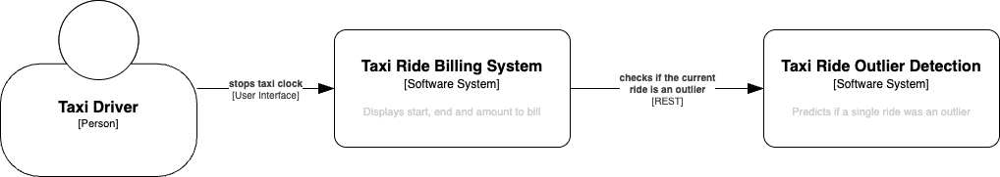
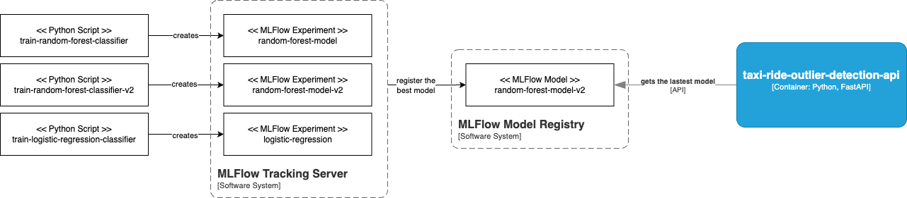

# AIS DEV2IL - MLOps - Taxi Ride Outlier Detection

This is an example project used in the exercise course of the DEV2IL lecture. 
It implements the batch prediction, as well as the online prediction high level ML system designs. 

Please note that the focus of this lecture is to show how to bring models into production. The trained models are of very poor quality, which is silently ignored for the sake of simplicity. 

There are different checkpoints, which are managed as Git tags. Checkpoints 1 - 8 implement the 
the *Train-Run* training system option, and starting with checkpoint 9, the projects switches 
to the *Train-Persist-Run* raining system option.

| Tag | Description |
|----------|----------|
| taxi-ride-checkpoint-1-starter | Empty kickoff project  |
| taxi-ride-checkpoint-2-logic | Notebook, outlier detector and unit tests |
| taxi-ride-checkpoint-3-cli | outlier detection CLI application |
| taxi-ride-checkpoint-4-containerized | Docker |
| taxi-ride-checkpoint-5-ci | GitHub CI pipeline |
| taxi-ride-checkpoint-6-deploy-k8s | Deployment to K8S
| taxi-ride-checkpoint-7-drift-monitoring | Input data drift monitoring, Evidently AI |
| taxi-ride-checkpoint-8-workflows | Orchestration, Airflow |
| taxi-ride-checkpoint-9-train-persist-ci | Training of multiple models via CI |
| taxi-ride-checkpoint-10-train-persist-api | Online prediction, MLFlow, FastApi |

## Business Problem

You work for a taxi ride company. They want to start making rides more consistent by understanding longer journeys in order to improve customer experience and thus increase customer retention. 

## User Story 1: Detect unusual taxi rides

As a member of the operations team of the taxi ride company, I want to see which taxi rides were unusual compared to the all taxi rides of the same day.

Acceptance Criteria
- The list of unusual taxi rides for a day is available on the next day in the morning

Implementation Notes: This user story is implemented by checkpoints 1 to 8.

## High Level System Architecture

After some discussions with the developers of the taxi ride management software system, you agree on the following system integration architecture: 
- A file containing information on all taxi rides is put to a shared location at latest at 02:00 AM on the next day
- Unusual rides are written to a shared location at latest at 06:00 AM on the next day

You additionally agree on the following interface
- Data is exchanged in [Apache Parquet](https://parquet.apache.org/) format
- Input files follow the pattern `yyyy-mm-dd.taxi-rides.parquet`
- Output files follow the pattern `yyyy-mm-dd.taxi-rides.outliers.parquet`

Input file structure
| Column Name              | Description                  |
|--------------------------|-----------------------------|
| `tpep_pickup_datetime`   | Pickup time in UTC          |
| `tpep_dropoff_datetime`  | Dropoff time in UTC         |
| `trip_distance`          | Ride distance in miles      |

Output file structure
| Column Name | Description |
|-------------|-------------|
| `ride_id`   | The row index within the input file |
| `ride_dist` | The distance of the ride in miles   |
| `ride_time` | The time of the ride in seconds     |



## Outlier Detector Architecture



## Hint for For Windows Users

Everyting should work out without problems if your are using WSL. If you, however, are using another terminal, such as Power Shell or Git Bash, you might be confronted with one or the other problem that you need to solve on your own. 


## Setup

Make sure that you are using a `bash` terminal.

```
# Create and activate a virtual environment
python -m venv .venv
source .venv/bin/activate

# Install runtime requirements and add project in edit mode
pip install -e .
# Install development and test requirements
pip install .[dev]
pip install .[test]
```

### Hint for For Windows Users

The commands won't work with Power Shell. Use e.g. Git Bash in the Visual Studio Code terminal. 

Depending on your Python installation, your `.venv` might look a bit different. If you are having troubles running 
`source .venv/bin/activate` have a look at the `.venv` folder and adapt the path (most likely it's `source .venv/Scripts/activate` then)

## Notebook environment

Run `jupyter notebook` to work with the notebooks without IDE.

When using an IDE, make sure that the IDE is configured to use the project's virtual environment and that that the notebook working directory is the directory where the notebook files is located.

## Testing 

Run `pytest`.
In order to see logging and stdout outputs, use `pytest -s --log-cli-level=DEBUG`.

## Running the outlier detector on your developer machine

### Outlier Detector

Run `detect-taxi-ride-outliers`.

Example data can be found in the [work](./work) folder. Run `detect-taxi-ride-outliers ./work 2025-01-15` to detect outliers for example data.

## Working with Docker on your developer machine

To build the `taxi-rides-outlier-detection` image, run `sh build-image.sh`. 

To find outliers from a file on your local file system run `sh run-container.sh`. Run `sh run-container.sh ./work 2025-01-15` to detect outliers for example data.

### Hint for Windows Users

`run-container.sh` mounts an absolute path as volume. This should work out fine, when you are using WSL. WSL usually mounts your C: drive to `/mnt/c` - the used `pwd` command will reflect this. If you are using other shells, you will need to either pass a relative path or replace the `\` of your path with `/`. 

## Working With the GitHub Packages Container Registry

### Using the Terminal 

In order to authenticate, you need to create a personal access token and authenticate. Follow the steps as outlined here: https://docs.github.com/en/packages/working-with-a-github-packages-registry/working-with-the-container-registry#authenticating-with-a-personal-access-token-classic

To build the `taxi-rides-outlier-detection` image, run `sh build-image-github.sh`. 

To find outliers from a file on your local file system run `sh run-container-gitlab.sh`. Run `sh run-container-gitlab.sh peterrietzler 1.0.1 ./work 2025-01-15` to detect outliers for example data.

### Using GitHub Actions

See https://docs.github.com/en/actions/use-cases-and-examples/publishing-packages/publishing-docker-images#publishing-images-to-github-packages

In order to allow your workflow to publish docker images, you need to connect the repository with the package. Make sure that you have created the package using the terminal, then 
1. Open your profile: In the top right corner of GitHub, click your profile photo, then click Your profile.
1. Open the *Packages* tab
1. Select the `taxi-rides-outlier-detection` package
1. Open *Package settings*
1. Add your repository and select the *Write* role for it

## Running the Kubernetes Cron Job

As only absolute paths can be mounted in K8S as volume, you need to **adapt the volume mounts in the deployment descriptors**.

1. Deploy the cron job by running `kubectl apply -f deploy/k8s/taxi-rides-outlier-detection-cronjob.yaml`

Further useful commands
- List cron jobs: `kubectl get cronjobs`
- List cron jobs: `kubectl get jobs`
- List pods: `kubectl get pods`
- Follow logs of a pod: `kubectl logs -f POD_NAME`
- Get more information for a pod (e.g. for problem analysis): `kubectl describe pod POD_NAME`
- Delete a pod: `kubectl delete pod POD_NAME`
- Delete a job or cron job: `kubectl delete -f deploy/k8s/local/taxi-rides-outlier-detection-cronjob.yaml`

### Hint for Windows Users

Docker desktop mounts your C: drive to `/run/desktop/mnt/host/c`. 

## Running Input Data Drift Detection

Run `detect-input-data-drift`. The command works similar to 
`detect-taxi-ride-outliers`. Also all K8S options are available similarly.

## Record Monitoring Snapshots using Evidently

Get more information at https://github.com/evidentlyai/evidently
and https://docs.evidentlyai.com/docs/platform/monitoring_overview

1. Run `evidently ui` in the root project folder to start the user interface
1. Run `detect-input-data-drift` using the `--evidently-project-id` option to record snapshots

## Orchestrate Taxi Ride Outlier Detection via Airflow



1. `kubectl apply -f deploy/airflow`
1. Get the `admin` password via `kubectl logs -f airflow`
1. `kubectl port-forward service/airflow-service 8080:8080`
1. Login at http://localhost:8080 (`admin` / password as obtained from the logs)

## User Story 2: Detect Outliers Based on Operator Input

Members of the operations team have analysed the detected outliers for a couple of years and have labelled all marked taxi rides that they really considered to be an output. The outlier detection system should now be changed in a way to reflect this input. 

Acceptance Criteria
- The list of unusual taxi rides for a day is calculated bx taking the input of the operations team into account

Implementation Notes: This user story is implemented by checkpoint 9.

## High Level System Architecture

Will stay the same, except for the fact that the model training system is going to be changed. 

## Training System Design

The labeleled data is provided in the file [.data/labeled/taxi-rides.parquet](./data/labeled/taxi-rides.parquet). 

We decide to come up with a couple of different approaches, which can be trained independently of each other. The outlier detection job is changed in a way, so that it can transparently use any of the trained models:



## Training the Classifiers

`train-random-forest-classifier data/labeled/taxi-rides.parquet random-forest-classifier`

`train-random-forest-classifier-v2 data/labeled/taxi-rides.parquet random-forest-classifier`

`train-logistic-regression-classifier data/labeled/taxi-rides.parquet logistic-regression-classifier`

## Detecting Outliers

Run `detect-taxi-ride-outliers-with-classifier`.

## CI Pipeline

The CI pipeline is going to train all 3 models automatically and uses the one with the highest F1 score for outliers. 



## User Story 3: Detect Outliers On the Fly

As a taxi ride company we want highest customer satisfaction. We therefore grant a 50% discount for every taxi ride that is an outlier. 

Acceptance Criteria
- The taxi ride billing system provides a discount of 50% if the taxi ride is unusual

Implementation Notes: This user story is implemented by checkpoint 10.

## High Level System Architecture



We choose to use MLFlow to register our models (which are the same as before). For the sake of simplicity of the whole develoment environment setup for this project, the CI pipeline for the outlier detection jobs is not changed. 



## Train the Classifiers

Same as above. Make sure to run it in the root folder of this project. 

## Inspecting the Trained Models and Selecting the One Used for Production

Start the MLFlow server: `mlflow server` and open the URL in your browser.

## Running the API Server and Detect Outliers

Start the MLFlow server: `mlflow server`.

Run `fastapi dev taxi_rides_outlier_detection/api.py` and open http://127.0.0.1:8000/docs in your browser.